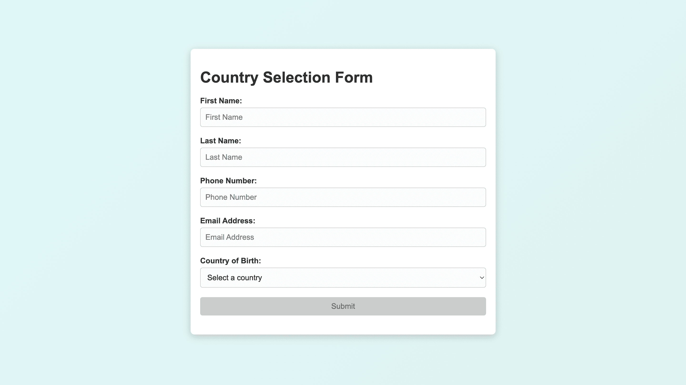

## Objective
The goal was to create a simple, responsive, and ADA-compliant country selection form that allows users to:
- Enter personal information.
- Select a country from a dynamically populated dropdown list.
- Submit the form and display a confirmation message.

This project focused on accessibility, user experience, and error handling while ensuring the code is maintainable and modular.

## Key Decisions and Reasoning

## 1. Form Design and Layout
Why?
A responsive, user-friendly layout is essential for accessibility and usability.
How?
Used CSS Flexbox to create a clean, centered layout that adapts to various screen sizes.
Applied CSS variables for easy theme customization (e.g., colors and gradients).
Ensured ADA compliance with proper labels, focus indicators, and error feedback.

## 2. Dynamic Country Dropdown
Why?
Fetching real-time country data ensures the form remains up-to-date with accurate country names.
How?
Used the REST Countries API to retrieve a list of countries.
Sorted the countries alphabetically for better user experience.
Implemented error handling to alert the user if the API call fails and display an appropriate fallback message.

## 3. Validation
Why?
Input validation ensures the data submitted is accurate and consistent.
How?
Used HTML5 features like required attributes and pattern for phone number validation.
Added JavaScript validation to dynamically enable/disable the submit button based on form completion.

## 4. Accessibility
Why?
Accessibility ensures the form can be used by everyone, including users with disabilities.
How?
Used semantic HTML elements like <label> for form inputs.
Ensured focus indicators and proper ARIA attributes for screen readers.
Tested keyboard navigation to confirm compatibility.

## 5. Error Handling
Why?
Providing feedback for issues (e.g., API failure or incomplete form fields) improves user experience.
How?
Implemented try-catch blocks to handle API errors gracefully.
Alerted the user with error messages when something went wrong.

## Challenges Faced

## 1. API Latency and Error Handling
Challenge: The REST Countries API response might be delayed or fail due to network issues.
Solution:
Added a "Loading countries..." placeholder while the API fetches data.
Displayed an error message and alerted the user if the API call failed.

## 2. Accessibility Testing
Challenge: Ensuring the form is fully accessible for screen readers and keyboard users.
Solution:
Used aria-labels and tested keyboard navigation to verify compliance with WCAG 2.1 guidelines.

## 3. Validation Logic
Challenge: Dynamically enabling the submit button only when all fields are valid.
Solution:
Added an input and change event listener to check form completion dynamically.
Used both HTML5 validation (e.g., required, pattern) and JavaScript for robust error handling.

## 4. Cross-Origin Restrictions
Challenge: Some browsers might block API requests due to CORS issues.
Solution:
Tested the form in a local server environment (e.g., VS Code Live Server) to avoid restrictions during development.

## Lessons Learned
Modularity is Key:
Breaking the JavaScript code into smaller, reusable functions (e.g., populateCountries, checkFormCompletion) made the code easier to read and maintain.

## Accessibility Needs Attention:
Designing with WCAG 2.1 in mind ensures the form is usable by a broader audience.

## Error Handling is Crucial:
Anticipating and handling errors (e.g., API failures) improves the robustness and user experience of the application.

## Conclusion
This project helped demonstrate the importance of balancing functionality, accessibility, and user experience. The decisions made were focused on creating a clean, responsive, and accessible form that works seamlessly across devices and browsers.

## Installation
1. Clone this repository:
   git clone https://github.com/arush98/country-selection-form.git

2. cd to form-nutramax

3. On terminal open index.html

   